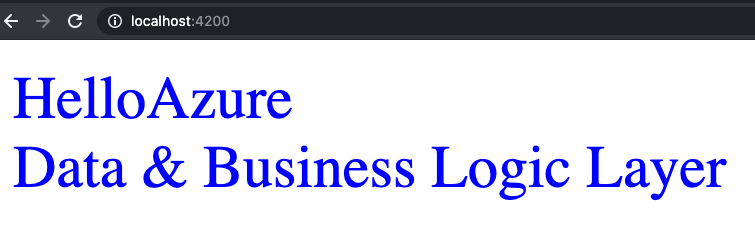
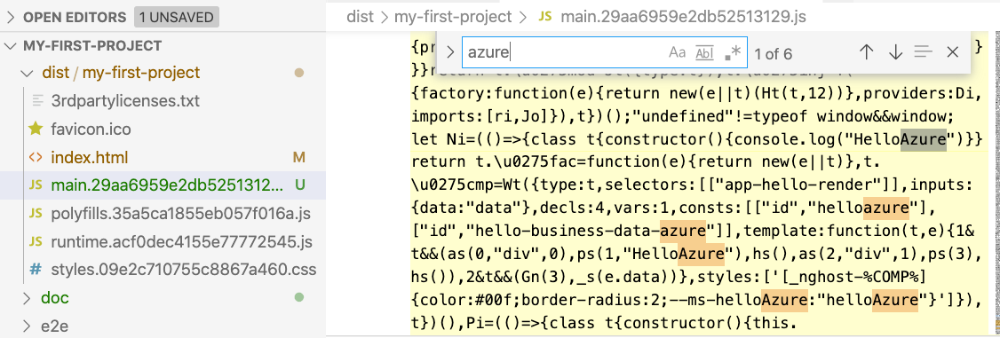
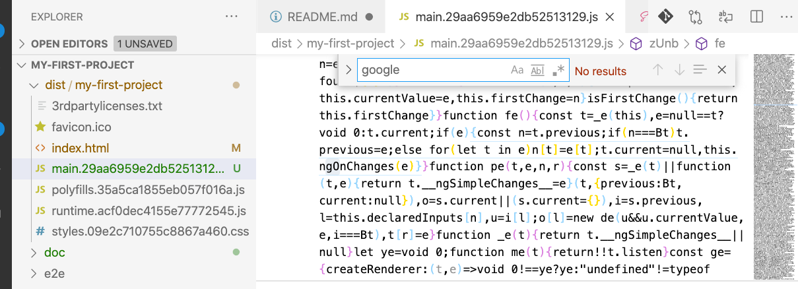
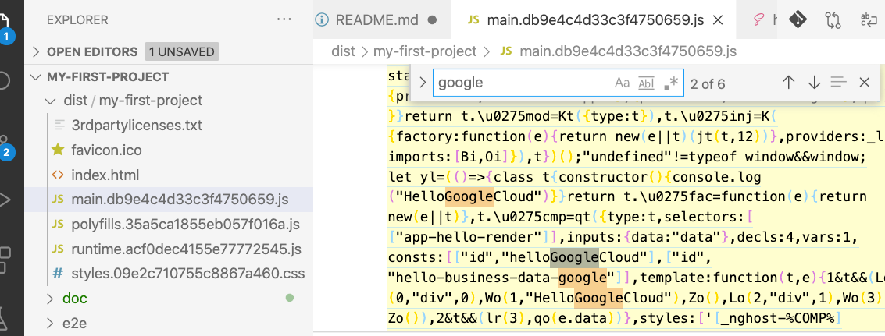

# Angular Development Server and Typescript Compiler Via Docker

- In this project, I dockerized one of my github repo I published before.

# Plan

- I will use docker to offer an Angular development server.
- The server will watch the source code in `./src` and recompile the project on code changes
- It will serve the Angular web app in port `:4200` and expose the port to its host so that developer could visit it from Chrome browser via `http://localhost:4200`
- Also, developers are able to compile the source code and generate the target in `./dist` folder

# Commands

- Build the docker image
  - `docker build -t angular-dev-server .`
    
- Run the `docker run -v $(pwd):/ng-app --workdir=/ng-app angular-dev-server npm install` command to install all the dependencies
- Run the `npm run serve` command to start a development server with the code in `./src`
  - `docker run -v $(pwd):/root/src --workdir=/root/src -p 4200:4200 angular-dev-server "npm install"`
  - Feed the docker container with source data in local folder
    - `docker run `
  - Get the

# Angular template project for multiple render bundling

- You may want to deploy different code bundle in different cloud platforms or environments
- For example, you may create different renderer for Google Cloud and its counter part for Azure.
- Due to code inspection/regulation policies, the code run in Google Cloud production should not include any code that is only for Azure
  - No CSS
  - No JS
  - No HTML
- This project offers a simple architecture for you to get started

## Technology concerns

- We create different environments for different renderer in `angular.json`
- We import different rendering modules according to the environment
- UglifyJS compiler will perform static code analysis and remove the module that is not included in the current environment
  - UglifyJS will remove JS/HTML/CSS code all together in the production bundle

## Init

- `npm install`

## Development server

### Develop Azure Renderer

- Run `npm run serve-azure` for a dev server.
- Navigate to `http://localhost:4200/`.
  

### Develop GoogleCloud Renderer

- Run `npm run serve-googlecloud` for a dev server.
- Navigate to `http://localhost:4200/`.
  

## Build

### Build Azure Renderer in production

- Run `npm run build-azure`
- Check `dist/my-first-project` and you will find only CSS/JS/HTML code of Azure
  - Only Azure renderer code: 
  - No GoogleCloud renderer code: 

### Build GoogleCloud Renderer in production

- Run `npm run build-googlecloud`
- Check `dist/my-first-project` and you will find only CSS/JS/HTML code of GoogleCloud
  - Only GoogleCloud render code this time 

## Running unit tests

Run `ng test` to execute the unit tests via [Karma](https://karma-runner.github.io).

## Running end-to-end tests

Run `ng e2e` to execute the end-to-end tests via [Protractor](http://www.protractortest.org/).

## Angular version

- 10.2

## License

- MIT

## Author

- Paul Shunfang Lan, https://xiaofang.me
