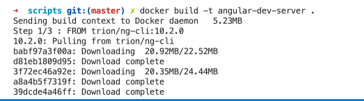
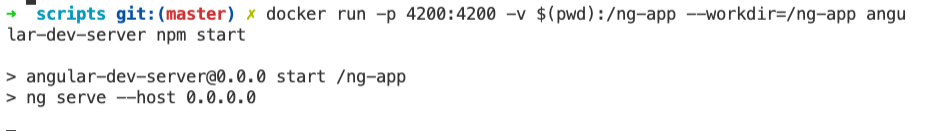
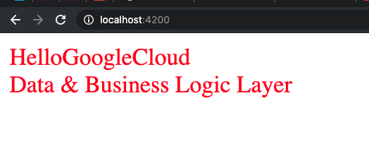
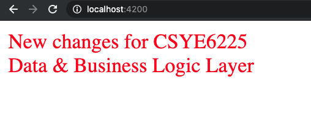

# Angular Development Server and Typescript Compiler Via Docker

- In this project, I dockerize one of my github repo (Angular 10 app) I published before.
  - See the [origin repo](https://github.com/lanshunfang/angular-template-project-multiple-render-bundle)
- It simplifies the development environment preparation for new developers
- It added no extra libraries in the host machine
- Developers with this solution will have the same compilation code and running environments even they use different OS, like `macOS`, `Windows` or `Linux`

# Plan

- We use a docker container to offer an Angular development server.
- The docker container will read data through the `mounted` folder in current working directory in host OS.
- It will also watch the source code in `./src` and recompile the project on code changes.
- It will serve the Angular web app in port `:4200` and expose the port to its host so that developers could visit it from Chrome browser via `http://localhost:4200`.
- Chrome browser will reload automatically on any code changes in `./src`
- Also, developers are able to compile the source code and generate the bundle to `./dist` folder

# Usage

- Build the docker image
  - `docker build -t angular-dev-server .`
    
- Install dependencies
  - `docker run -v $(pwd):/ng-app --workdir=/ng-app angular-dev-server npm install`
- Start dev server at port `4200`
  - `docker run -p 4200:4200 -v $(pwd):/ng-app --workdir=/ng-app angular-dev-server npm start`
    
- Open Chrome to see the result at url: `http://localhost:4200` from host machine
  
- Try to make some changes with files in `./src` and the browser will refresh automatically after auto recompilation
  
- Build production release
  - `docker run -v $(pwd):/ng-app --workdir=/ng-app angular-dev-server npm run build`

## License

- MIT

## Author

- Paul Shunfang Lan, https://xiaofang.me
